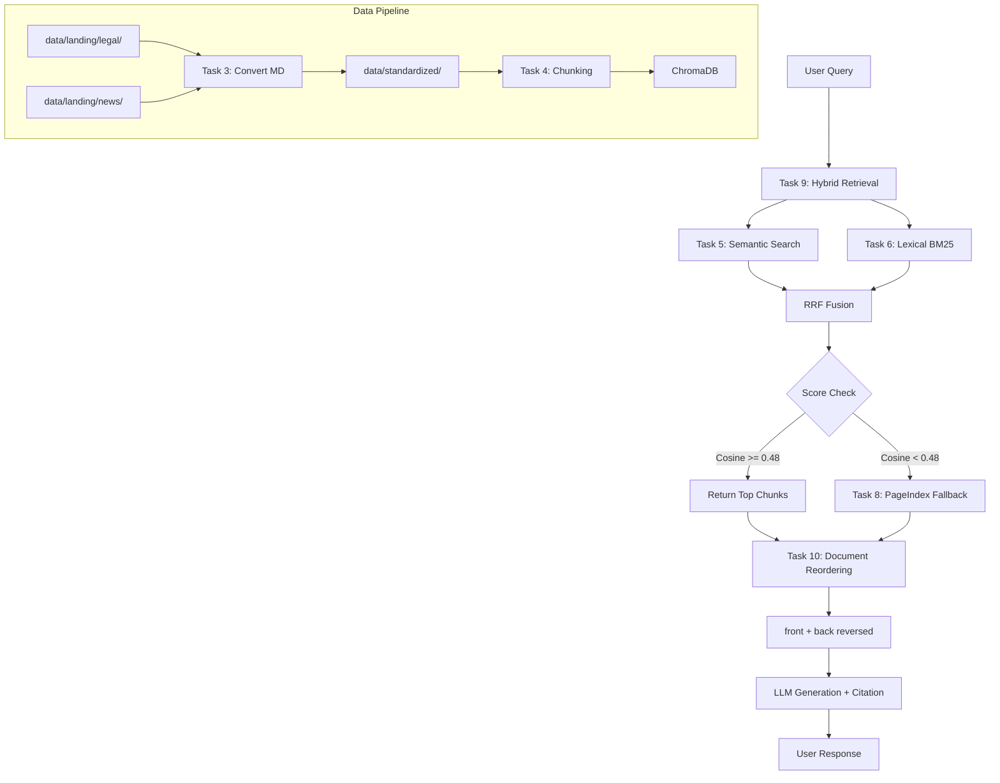

# KẾ HOẠCH BÀI LAB - RAG PIPELINE V2
## Chủ đề: Trợ Lý Hỏi Đáp Luật Lao Động Cho Người Trẻ

---

## 1. Tổng Quan

| Thông tin | Chi tiết |
|-----------|----------|
| **Chủ đề** | Trợ Lý Hỏi Đáp Luật Lao Động Cho Người Trẻ |
| **Mô tả** | Trợ lý AI tra cứu và giải đáp các vấn đề pháp lý lao động phổ biến cho Gen Z (thử việc, OT, nghỉ phép, hợp đồng học việc, sa thải) |
| **Nguồn dữ liệu** | Bộ luật Lao động 2019, Nghị định hướng dẫn, Hợp đồng lao động mẫu |
| **Số thành viên** | 3 người |
| **Thời lượng** | 3 giờ (180 phút) |
| **Tổng điểm** | 100 điểm (50đ cá nhân + 30đ nhóm + 20đ bonus) |

---

## 2. Câu Hỏi Truy Vấn Mẫu

- *"Thời gian thử việc tối đa cho vị trí lập trình viên là bao lâu và lương thử việc tối thiểu bằng bao nhiêu % lương chính thức?"*
- *"Công ty sa thải tôi qua tin nhắn Zalo mà không báo trước 30 ngày thì có đúng luật không?"*
- *"Hồ sơ ký kết hợp đồng lao động cần những giấy tờ gì?"*
- *"Quy định về thời giờ làm việc bình thường là mấy giờ?"*

---

## 3. Phân Công Nhiệm Vụ

### 3.1. Thành Viên 1 - Team Leader & Data Specialist

**Nhiệm vụ chính:** Setup môi trường + Thu thập & Xử lý dữ liệu

| Task | Công Việc | Output | Thời gian |
|------|-----------|--------|-----------|
| CP0 | Setup `.env`, `venv`, cài `requirements.txt` | Môi trường sẵn sàng | 0:00-0:10 |
| Task 1 | Tải ≥3 văn bản pháp luật lao động (PDF luật, nghị định) | `data/landing/legal/` | 0:10-0:20 |
| Task 2 | Crawl ≥5 bài viết tin tức/hướng dẫn lao động | `data/landing/news/` | 0:20-0:35 |
| Task 3 | Convert tất cả file sang Markdown | `data/standardized/` | 0:35 |
| Task 4 | Chunking (800 ký tự / 100 overlap) + ChromaDB indexing với model `BAAI/bge-m3` | `chroma_db/` | 0:35-1:00 |

### 3.2. Thành Viên 2 - Retrieval & Generation Specialist

**Nhiệm vụ chính:** Xây dựng modules tìm kiếm và generation

| Task | Công Việc | File | Thời gian |
|------|-----------|------|-----------|
| Task 5 | Semantic search (Cosine Similarity + HyDE) | `src/task5_semantic_search.py` | 0:35-0:45 |
| Task 6 | Lexical search (BM25/TF-IDF) | `src/task6_lexical_search.py` | 0:45-1:00 |
| Task 7 | RRF Reranking (công thức: `RRF(d) = Σ 1/(60 + r(d))`) | `src/task7_reranking.py` | 1:00-1:10 |
| Task 8 | PageIndex Vectorless Fallback | `src/task8_pageindex_vectorless.py` | 1:10-1:20 |
| Task 9 | **Pipeline hoàn chỉnh**: Hybrid + Fallback khi `Cosine < 0.48` | `src/task9_retrieval_pipeline.py` | 1:20-1:35 |
| Task 10 | Document Reordering (`front + back[::-1]`) + Citation Generation | `src/task10_generation.py` | 1:35-1:45 |

### 3.3. Thành Viên 3 - Evaluation & QA Engineer

**Nhiệm vụ chính:** Kiểm thử + Bài nhóm

| Task | Công Việc | File | Thời gian |
|------|-----------|------|-----------|
| Test | Chạy `pytest tests/test_individual.py` - đạt **35/35 passed** | Kiểm tra 50đ | 1:45 |
| Group | Xây dựng Golden Dataset ≥15 Q&A | `group_project/evaluation/golden_dataset.json` | 1:45-2:00 |
| Group | Evaluation với RAGAS (4 metrics: Faithfulness, Relevance, Recall, Precision) | `group_project/evaluation/eval_pipeline.py` | 2:00-2:10 |
| Group | Báo cáo A/B comparison (Hybrid vs Dense-only) | `group_project/evaluation/results.md` | 2:10-2:15 |
| Group | Hoàn thiện Chatbot Streamlit UI | `app.py` | 1:45-2:15 |

---

## 4. Timeline Checkpoint

```
┌─────────────────────────────────────────────────────────────────────────────┐
│ 0:00-0:10  │ CP0: Setup môi trường, .env với OPENROUTER_API_KEY            │
├─────────────────────────────────────────────────────────────────────────────┤
│ 0:10-0:35  │ CP1: Task 1-3 (≥3 PDF, ≥5 news, convert MD)                  │
├─────────────────────────────────────────────────────────────────────────────┤
│ 0:35-1:00  │ CP2: Task 4-6 (ChromaDB, Semantic Search, BM25)              │
├─────────────────────────────────────────────────────────────────────────────┤
│ 1:00-1:20  │ CP3: Task 7-8 (RRF Rerank + PageIndex Fallback)              │
├─────────────────────────────────────────────────────────────────────────────┤
│ 1:20-1:45  │ CP4: Task 9-10 (Pipeline + Generation) ⭐ MỐC 50Đ CÁ NHÂN     │
├─────────────────────────────────────────────────────────────────────────────┤
│ 1:45-2:15  │ CP5: Bài nhóm (Chatbot UI + RAGAS Evaluation)                 │
├─────────────────────────────────────────────────────────────────────────────┤
│ 2:15-3:00  │ CP6: Thuyết trình Demo Live + Push GitHub                      │
└─────────────────────────────────────────────────────────────────────────────┘
```

---

## 5. Nguồn Dữ Liệu Cần Thu Thập

### 5.1. Task 1 - Văn Bản Pháp Luật (≥3 files)

| STT | Tên văn bản | Mô tả | Nguồn/URL |
|-----|-------------|-------|------------|
| 1 | Bộ luật Lao động 2019 | Luật số 45/2019/QH14 | vbpl.vn, thuvienphapluat.vn |
| 2 | Nghị định 145/2020/NĐ-CP | Hướng dẫn thi hành BLLĐ | vbpl.vn |
| 3 | Thông tư 10/2020/TT-BLĐTBXH | Hướng dẫn HĐLĐ và BHXH | molisa.gov.vn |

**Cách tải:**
- Truy cập vbpl.vn, tìm văn bản → Tải về định dạng PDF
- Hoặc tải trực tiếp từ các trang như:
  - https://thuvienphapluat.vn/van-ban/Lao-dong
  - https://luatvietnam.vn/labor

### 5.2. Task 2 - Tin Tức/Hướng Dẫn (≥5 files)

**URL gợi ý để crawl:**

| STT | URL | Chủ đề |
|-----|-----|---------|
| 1 | https://luatvietnam.vn/labor/thoi-viec-hop-dong-ld-46-2019-qh14.html | Thử việc |
| 2 | https://luatvietnam.vn/labor/ket-thuc-hop-dong-lao-dong-46-2019-qh14.html | Chấm dứt HĐLĐ |
| 3 | https://luatvietnam.vn/labor/tien-luong-46-2019-qh14.html | Tiền lương |
| 4 | https://luatvietnam.vn/labor/bao-hiem-xa-hoi-46-2019-qh14.html | BHXH |
| 5 | https://luatvietnam.vn/labor/nghi-phep-46-2019-qh14.html | Nghỉ phép |

---

## 6. Chi Tiết Checkpoint 1 (CP0 + CP1)

### 6.1. CP0: Setup Môi Trường (0:00 - 0:10)

**Thành viên phụ trách:** Thành viên 1 (Team Leader)

**Bước thực hiện:**

```bash
# 1. Tạo thư mục làm việc (nếu chưa có)
cd "d:\AI thực chiến\K3-Day08-E403-FileFlow"

# 2. Tạo virtual environment
python -m venv .venv

# 3. Activate
.venv\Scripts\activate

# 4. Cài dependencies
pip install -r requirements.txt

# 5. Cài thêm markitdown[pdf] (REQUIRED cho Task 3)
pip install "markitdown[pdf]"

# 6. Cài playwright chromium (REQUIRED cho Task 2)
playwright install chromium

# 7. Copy và cấu hình .env
copy .env.example .env
# Mở .env và điền OPENROUTER_API_KEY
```

**Pass Criteria CP0:**
- [ ] Lệnh `python -c "import chromadb; import sentence_transformers"` không lỗi
- [ ] File `.env` tồn tại và có `OPENROUTER_API_KEY`

### 6.2. CP1: Thu Thập & Xử Lý Dữ Liệu (0:10 - 0:35)

**Thành viên phụ trách:** Thành viên 1 (tiếp tục)

**Task 1: Tải ≥3 văn bản pháp luật (0:10 - 0:20)**

1. **Cách 1: Tải thủ công**
   - Truy cập https://thuvienphapluat.vn/van-ban/Lao-dong
   - Tìm và tải PDF:
     - Bộ luật Lao động 2019 (Luật 45/2019/QH14)
     - Nghị định 145/2020/NĐ-CP
     - Thông tư 10/2020/TT-BLĐTBXH
   - Lưu vào `data/landing/legal/` với tên:
     - `bo-luat-lao-dong-2019.pdf`
     - `nghi-dinh-145-2020-nd-cp.pdf`
     - `thong-tu-10-2020-tt-bldtbxh.pdf`

2. **Cách 2: Dùng script** (nếu có direct link)

```python
# Trong task1_collect_legal_docs.py - bổ sung:
import requests
from pathlib import Path

DATA_DIR = Path(__file__).parent.parent / "data" / "landing" / "legal"

# Các direct link (tìm trên vbpl.vn/thuvienphapluat.vn)
DOCUMENTS = [
    {
        "url": "https://thuvienphapluat.vn/van-ban/Lao-dong/Bo-luat-lao-dong-2019-45-2019-QH14-271388.aspx",
        "filename": "bo-luat-lao-dong-2019.pdf"
    },
    # Thêm các link khác...
]

def download_file(url: str, filename: str):
    response = requests.get(url, headers={"User-Agent": "Mozilla/5.0"})
    if response.status_code == 200:
        filepath = DATA_DIR / filename
        filepath.write_bytes(response.content)
        print(f"✓ Đã tải: {filename}")
    else:
        print(f"✗ Lỗi {response.status_code}: {url}")
```

**Pass Criteria Task 1:**
- [ ] ≥3 file trong `data/landing/legal/`
- [ ] File là PDF hoặc DOCX

---

**Task 2: Crawl ≥5 bài viết tin tức (0:20 - 0:30)**

```python
# Trong task2_crawl_news.py - sửa ARTICLE_URLS:

ARTICLE_URLS = [
    # Thử việc
    "https://luatvietnam.vn/labor/thoi-viec-hop-dong-ld-46-2019-qh14.html",
    # Chấm dứt HĐLĐ
    "https://luatvietnam.vn/labor/ket-thuc-hop-dong-lao-dong-46-2019-qh14.html",
    # Tiền lương
    "https://luatvietnam.vn/labor/tien-luong-46-2019-qh14.html",
    # BHXH
    "https://luatvietnam.vn/labor/bao-hiem-xa-hoi-46-2019-qh14.html",
    # Nghỉ phép
    "https://luatvietnam.vn/labor/nghi-phep-46-2019-qh14.html",
]

async def crawl_article(url: str) -> dict:
    """Implement crawl với Crawl4AI."""
    from crawl4ai import AsyncWebCrawler
    
    async with AsyncWebCrawler() as crawler:
        result = await crawler.arun(url=url)
        return {
            "url": url,
            "title": result.metadata.get("title", url.split("/")[-1]),
            "date_crawled": datetime.now().isoformat(),
            "content_markdown": result.markdown,
            "source": "luatvietnam.vn"
        }
```

**Pass Criteria Task 2:**
- [ ] ≥5 file JSON trong `data/landing/news/`
- [ ] Mỗi file có: `url`, `title`, `date_crawled`, `content_markdown`

---

**Task 3: Convert sang Markdown (0:30 - 0:35)**

```python
# Trong task3_convert_markdown.py - đã có sẵn, chạy:

# Đảm bảo đã cài: pip install "markitdown[pdf]"

python -m src.task3_convert_markdown
```

**Pass Criteria Task 3:**
- [ ] Files `.md` trong `data/standardized/legal/`
- [ ] Files `.md` trong `data/standardized/news/`

---

### 6.3. Summary Checkpoint 1

```
CP0 (0:00-0:10): ✓ Setup môi trường
├── Tạo .venv
├── Cài requirements.txt
├── Cài "markitdown[pdf]"
├── Cài playwright chromium
└── Tạo .env với OPENROUTER_API_KEY

CP1 (0:10-0:35): ✓ Thu thập & Xử lý Dữ liệu
├── Task 1: ≥3 PDF trong data/landing/legal/
│   ├── bo-luat-lao-dong-2019.pdf
│   ├── nghi-dinh-145-2020-nd-cp.pdf
│   └── thong-tu-10-2020-tt-bldtbxh.pdf
│
├── Task 2: ≥5 JSON trong data/landing/news/
│   ├── article_01.json (thử việc)
│   ├── article_02.json (chấm dứt HĐLĐ)
│   ├── article_03.json (tiền lương)
│   ├── article_04.json (BHXH)
│   └── article_05.json (nghỉ phép)
│
└── Task 3: Convert MD trong data/standardized/
    ├── legal/
    │   ├── bo-luat-lao-dong-2019.md
    │   ├── nghi-dinh-145-2020-nd-cp.md
    │   └── thong-tu-10-2020-tt-bldtbxh.md
    └── news/
        ├── article_01.md
        ├── article_02.md
        ├── article_03.md
        ├── article_04.md
        └── article_05.md
```

---

## 6. Câu Hỏi Mẫu Cho Golden Dataset (15+ câu)

1. Thời gian thử việc tối đa là bao lâu theo luật?
2. Lương thử việc tối thiểu bằng bao nhiêu % lương chính thức?
3. Công ty có được sa thải nhân viên qua tin nhắn Zalo không?
4. Thời hạn báo trước khi chấm dứt HĐLĐ là bao lâu?
5. Hồ sơ ký kết hợp đồng lao động gồm những gì?
6. Quy định về thời giờ làm việc bình thường là mấy giờ?
7. Lao động nữ được nghỉ thai sản bao lâu?
8. Tiền lương làm thêm giờ được tính như thế nào?
9. Khi nào người sử dụng lao động được phép kết thúc HĐLĐ?
10. Học sinh, sinh viên có được ký hợp đồng học việc không?
11. Điều kiện để HĐLĐ xác định thời hạn trở thành HĐLĐ không xác định thời hạn?
12. Người lao động có được từ chối làm việc ban đêm không?
13. Quyền đơn phương chấm dứt HĐLĐ của người lao động?
14. Công ty có phải đóng bảo hiểm xã hội cho lao động không?
15. Lương khoán được tính như thế nào theo luật?

---

## 7. Kỹ Thuật Quan Trọng

### 7.1. RRF (Reciprocal Rank Fusion)
```python
# Công thức: RRF(d) = Σ 1/(60 + r(d))
# k = 60 (constant để tránh chia cho 0)
# r(d) = rank của document trong mỗi retrieval method

def rerank_rrf(dense_results, sparse_results, k=60):
    scores = {}
    for rank, doc in enumerate(dense_results):
        doc_id = doc['id']
        scores[doc_id] = scores.get(doc_id, 0) + 1 / (k + rank + 1)
    for rank, doc in enumerate(sparse_results):
        doc_id = doc['id']
        scores[doc_id] = scores.get(doc_id, 0) + 1 / (k + rank + 1)
    return sorted(scores.items(), key=lambda x: x[1], reverse=True)
```

### 7.2. Fallback Logic (CRITICAL)
```python
# ⚠️ SAI: So sánh với điểm RRF (luôn ~0.016)
if rrf_score < 0.48:  # ❌ SAI!

# ✅ ĐÚNG: So sánh với điểm Cosine gốc
cosine_score = dense_results[0]["score"]  # Thang [0, 1]
if cosine_score < 0.48:
    # Chuyển sang PageIndex Fallback
    return pageindex_search(query)
```

### 7.3. Document Reordering (Lost-in-the-Middle Prevention)
```python
# Pattern: quan trọng nhất ở đầu và cuối, ít quan trọng ở giữa
def reorder_for_llm(chunks):
    n = len(chunks)
    if n <= 2:
        return chunks
    front = chunks[:n//2]      # Đầu
    back = chunks[n//2:][::-1] # Cuối (đảo ngược)
    return front + back
```

### 7.4. Citation Format
```
[Nguồn: Bộ luật Lao động 2019, Điều 16]
[Nguồn: Nghị định 145/2020/NĐ-CP, Khoản 2 Điều 8]
```

---

## 8. Cấu Trúc Thư Mục

```
K3-Day08-E403-FileFlow/
├── README.md
├── LAB_GUIDE.md
├── checkpoint_timer.html
├── app.py                     # Streamlit Chatbot
├── requirements.txt
├── .env                       # API Keys
├── .env.example
├── data/
│   ├── landing/
│   │   ├── legal/            # Task 1: ≥3 PDF files
│   │   └── news/             # Task 2: ≥5 JSON files
│   └── standardized/
│       ├── legal/            # Task 3: Markdown files
│       └── news/
├── src/
│   ├── __init__.py
│   ├── task1_collect_legal_docs.py
│   ├── task2_crawl_news.py
│   ├── task3_convert_markdown.py
│   ├── task4_chunking_indexing.py
│   ├── task5_semantic_search.py
│   ├── task6_lexical_search.py
│   ├── task7_reranking.py
│   ├── task8_pageindex_vectorless.py
│   ├── task9_retrieval_pipeline.py
│   └── task10_generation.py
├── chroma_db/                 # Vector store (sau Task 4)
├── tests/
│   └── test_individual.py    # Chấm điểm 35 tests
└── group_project/
    ├── README.md
    └── evaluation/
        ├── golden_dataset.json   # 15+ Q&A pairs
        ├── eval_pipeline.py      # RAGAS evaluation
        └── results.md            # A/B comparison report
```

---

## 9. Cách Chấm Điểm

### 9.1. Điểm Cá Nhân - 50 điểm

| Task | Nội dung | Điểm | Pass Criteria |
|------|----------|------|---------------|
| 1 | Thu thập văn bản pháp luật (≥3 files) | 3 | Files tồn tại trong `data/landing/legal/` |
| 2 | Crawl bài viết (≥5 files) | 3 | Files tồn tại trong `data/landing/news/` |
| 3 | Convert Markdown | 4 | Files tồn tại trong `data/standardized/` |
| 4 | Chunking + ChromaDB | 7 | Vector store có data |
| 5 | Semantic search | 6 | Output đúng format, sorted |
| 6 | Lexical search (BM25) | 6 | Output đúng format |
| 7 | RRF Reranking | 6 | Output re-sorted |
| 8 | PageIndex | 4 | Query trả kết quả |
| 9 | Pipeline + Fallback | 7 | Logic hoạt động |
| 10 | Generation + Citation | 4 | Citation có trong output |
| **Tổng** | | **50** | **pytest 35/35 PASSED** |

### 9.2. Điểm Nhóm - 30 điểm

| Tiêu chí | Điểm |
|----------|------|
| RAG Chatbot demo hoạt động | 8 |
| Tích hợp pipeline Task 1-10 | 4 |
| Kiến trúc rõ ràng + README | 3 |
| Chất lượng câu trả lời (citation) | 3 |
| **Evaluation Pipeline** | **12** |
| - Golden dataset ≥15 Q&A | 3 |
| - Eval với ≥4 metrics | 4 |
| - A/B comparison ≥2 configs | 3 |
| - Báo cáo + phân tích | 2 |

### 9.3. Bonus - 20 điểm

| Tiêu chí | Điểm |
|----------|------|
| Giải thích cơ chế lexical search khác BM25 | 5 |
| Implement HyDE / Query Expansion | 5 |
| Deploy chatbot online | 4 |
| Conversation memory (multi-turn) | 3 |
| UI/UX chất lượng cao | 3 |

---

## 10. Các Lỗi Thường Gặp & Cách Khắc Phục

| # | Lỗi | Nguyên nhân | Cách sửa |
|---|-----|-------------|----------|
| 1 | `MissingDependencyException` ở Task 3 | Thiếu markitdown pdf | `pip install "markitdown[pdf]"` |
| 2 | `BrowserType.launch` ở Task 2 | Chưa cài Chromium | `playwright install chromium` |
| 3 | `UnicodeEncodeError` trên Windows | Mã hóa console | `$env:PYTHONIOENCODING="utf-8"` |
| 4 | Fallback không bao giờ chạy | So với điểm RRF thay vì Cosine | Sửa: `dense_results[0]["score"] < 0.48` |
| 5 | Dữ liệu cũ lẫn mới | Chưa xóa `chroma_db/` | `Remove-Item -Recurse -Force chroma_db` |
| 6 | Rate Limit 429 ở RAGAS | Gọi LLM quá nhiều | Giảm số câu hỏi trong golden_dataset |

---

## 11. Hướng Dẫn Chạy

```bash
# Setup môi trường
python -m venv .venv
.venv\Scripts\activate
pip install -r requirements.txt

# Copy và cấu hình .env
copy .env.example .env
# Điền OPENROUTER_API_KEY vào .env

# Chạy từng Task
python -m src.task1_collect_legal_docs
python -m src.task2_crawl_news
python -m src.task3_convert_markdown
python -m src.task4_chunking_indexing
# ...

# Kiểm tra điểm cá nhân
pytest tests/test_individual.py -v

# Chạy Chatbot
streamlit run app.py

# Chạy Evaluation
python -m group_project.evaluation.eval_pipeline
```

---

## 12. Checklist Hoàn Thành

### Phase 1: Setup (CP0)
- [ ] Tạo `.env` với `OPENROUTER_API_KEY`
- [ ] Cài đặt `venv` và dependencies
- [ ] Kiểm tra import không lỗi

### Phase 2: Data (CP1)
- [ ] ≥3 PDF trong `data/landing/legal/`
- [ ] ≥5 files trong `data/landing/news/`
- [ ] Files `.md` trong `data/standardized/`

### Phase 3: Search (CP2)
- [ ] `chroma_db/` được tạo với index
- [ ] Semantic search trả kết quả
- [ ] BM25 lexical search trả kết quả

### Phase 4: Advanced (CP3)
- [ ] RRF gộp thành công 2 rankers
- [ ] PageIndex fallback hoạt động

### Phase 5: Pipeline (CP4) ⭐
- [ ] `pytest tests/test_individual.py` = **35/35 PASSED**
- [ ] Pipeline end-to-end hoạt động
- [ ] Generation có citation đúng format

### Phase 6: Group (CP5)
- [ ] Golden dataset ≥15 Q&A
- [ ] RAGAS evaluation chạy thành công
- [ ] Chatbot UI hoạt động
- [ ] Results.md với A/B comparison

### Phase 7: Demo (CP6)
- [ ] Slide/thuyết trình sẵn sàng
- [ ] Demo live không lỗi
- [ ] Code push lên GitHub

---

## 13. Kiến Trúc Hệ Thống (Mermaid)



---

## 14. Các Link Tham Khảo

- [Crawl4AI](https://github.com/unclecode/crawl4ai) - Web crawling
- [MarkItDown](https://github.com/microsoft/markitdown) - Document converter
- [LangChain Text Splitters](https://python.langchain.com/docs/modules/data_connection/document_transformers/) - Chunking
- [BAAI/bge-m3](https://huggingface.co/BAAI/bge-m3) - Multilingual embedding
- [PageIndex](https://github.com/VectifyAI/PageIndex) - Vectorless RAG
- [RAGAS](https://github.com/explodinggradients/ragas) - RAG evaluation
- [Lost in the Middle (Liu et al. 2023)](https://arxiv.org/abs/2307.03172) - Research paper

---

*Plan được tạo: 2026-08-04*
*Chủ đề: Trợ Lý Hỏi Đáp Luật Lao Động Cho Người Trẻ*
*Nhóm: 3 thành viên*
